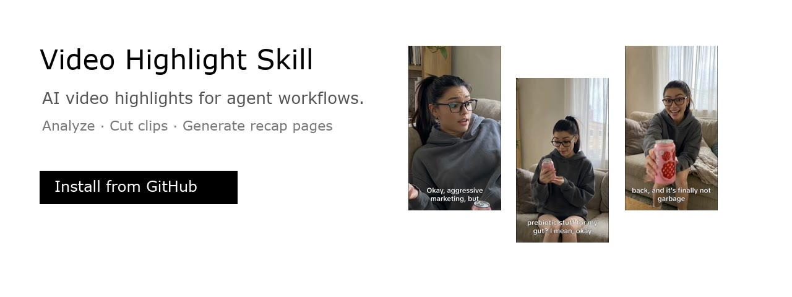

<div align="center">
  
  <h1>Video Highlight Skill</h1>
  <p><strong>AI video highlight skill for agents: analyze videos, cut clips with FFmpeg, export subtitles, and generate a shareable recap page.</strong></p>
  <p>
    <code>Claude Code</code> · <code>OpenClaw</code> · <code>Codex</code> · <code>Agent Skill</code>
  </p>
</div>

## Quick Start

Read this page and install this skill: [inhai-wiki/video-highlight-skill.git](https://github.com/inhai-wiki/video-highlight-skill.git)

Install the complete repository, including `SKILL.md`, `scripts/`, `references/`, `assets/`, and `agents/`.

Then give your Agent a video:

```text
Use video-highlight-skill to analyze this video, cut highlight clips, and generate a shareable recap page.
```

Compatible with Agent frameworks that support GitHub Skill installation, including Claude Code, OpenClaw, Codex, and custom Agent systems.

## What It Does

- Analyzes videos and builds timestamped highlight plans
- Cuts highlight clips with `ffmpeg`
- Exports sidecar SRT subtitles
- Generates a YouTube-style HTML recap page
- Supports long videos, meetings, courses, livestreams, demos, and short-form product videos

## Demo

Example: a 20-second product video is split into 3 highlight clips.

### Original input video

<p align="center">
  <video src="examples/demo-input/original-product-video.mp4" controls muted playsinline width="260"></video>
  <br />
  <sub>20-second source video used as the Agent input.</sub>
</p>

### Highlight clips

<table>
  <tr>
    <td width="33%" valign="top">
      <a href="examples/demo-clips/01-skepticism-turns-into-curiosity.mp4">
        
      </a>
      <br />
      <strong>1. Skepticism turns into curiosity</strong>
      <br />
      <code>0:00-0:05.2</code> · Hook
    </td>
    <td width="33%" valign="top">
      <a href="examples/demo-clips/02-benefit-stack-in-one-beat.mp4">
        
      </a>
      <br />
      <strong>2. Benefit stack in one beat</strong>
      <br />
      <code>0:05.2-0:12.4</code> · Product value
    </td>
    <td width="33%" valign="top">
      <a href="examples/demo-clips/03-taste-proof-and-direct-recommendation.mp4">
        
      </a>
      <br />
      <strong>3. Taste proof and direct recommendation</strong>
      <br />
      <code>0:12.4-0:20.1</code> · CTA
    </td>
  </tr>
</table>

Example plan:

```text
examples/poppi-raspberry-rose-plan.json
```

## Output Page

The generated recap page includes:

- Main video player on the left
- Scrollable highlight playlist on the right
- Video previews for each highlight
- Clip summary, quote, reason, score, tags, and takeaways
- GitHub link in the top navigation and footer

## Agent Output Contract

The Agent should generate a `clip_plan.json`:

```json
{
  "scenario": "highlight",
  "source_title": "Video title",
  "summary": "Short summary.",
  "segments": [],
  "highlights": [
    {
      "start": 0,
      "end": 30,
      "title": "Highlight title",
      "summary": "What happens in this clip.",
      "reason": "Why this clip matters.",
      "score": 90,
      "tags": ["demo"],
      "quote": "Representative quote.",
      "takeaways": ["Key takeaway"],
      "subtitles": []
    }
  ]
}
```

Full schema: [references/analysis-schema.md](references/analysis-schema.md)

## Requirements

- Python 3.9+
- `ffmpeg`
- `ffprobe`

Speech transcription and multimodal understanding can be provided by your Agent framework.

## License

MIT
